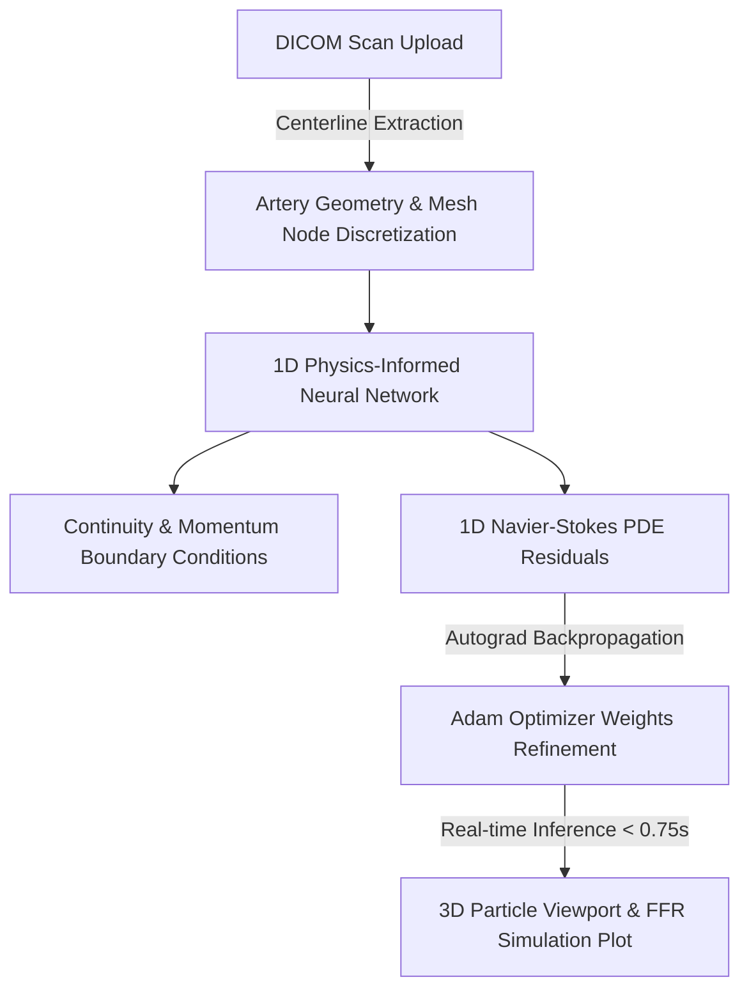

# CardioFlow AI 🩺💻

> **Next-Generation, Real-Time Non-Invasive Hemodynamic Profiling with 1D Physics-Informed Neural Networks (PINNs).**
>
> 🏆 *Built for medical diagnostics, surgical planning, and hackathon presentation excellence.*

---

## 💡 Executive Summary

Fractional Flow Reserve (FFR) is the clinical gold standard for assessing coronary artery stenosis severity. However, traditional clinical methods are **invasive**, requiring catheterization of the artery, while numerical 3D Computational Fluid Dynamics (CFD) methods require **hours of compute** on expensive cloud servers.

**CardioFlow AI** resolves this clinical bottleneck. By combining a lightweight **1D Navier-Stokes solver** with **Physics-Informed Neural Networks (PINNs)**, CardioFlow AI computes centerline pressure, velocity, and local FFR in **under 0.75 seconds** on consumer-grade CPU hardware, enabling real-time clinical diagnostics directly in the ICU or operating room.

---

## 🛠️ System Architecture

CardioFlow AI integrates spatial artery discretization with deep-learning backpropagation loops, enforcing the laws of fluid mechanics directly inside the network loss function:



### Mathematical Foundations

The PINN optimizes weights using the Navier-Stokes residual formulation as the loss function:

#### 1. Momentum Conservation PDE Residual
$$\frac{dP}{dx} + \rho v \frac{dv}{dx} + \frac{8 \pi \mu v}{A} + f_{\text{sep}} = 0$$

Where:
* $P$ is blood pressure, $v$ is flow velocity, $A$ is the local cross-sectional area.
* $\rho$ represents blood density ($1.05\text{ g/cm}^3$) and $\mu$ represents blood viscosity ($0.035\text{ Poise}$).
* $f_{\text{sep}}$ is the Young-Tsai separation loss modeling convective pressure drop in expansion zones downstream of a stenosis.

#### 2. Viscous Baseline Physics-Ansatz
$$P(x) = P_{\text{base}}(x) - x \cdot \hat{P}_{\delta}(x)$$

Guarantees boundary conditions are satisfied exactly: $P(0) = P_{\text{inlet}}$.

---

## 🚀 Key Features

1. **Vessel Optimization Chamber**: A high-end interactive training dashboard showing PyTorch PINN convergence, losses, and learning curves frame-by-frame.
2. **Timeline Playback Scrubber**: Clinicians can play, pause, and scrub back and forth across epochs to watch the model learn the boundary physics.
3. **WebGL 3D Particle Viewport**: A responsive Three.js particle model of the artery. Colors dynamically scale to FFR, Velocity, or Pressure profiles computed from the active playback frame.
4. **Interactive Pitch Presentation Deck**: An interactive, full-screen, liquid-animated slide deck summarizing the project mechanics, incorporating a live **1D Fluid Solver simulator** inside Slide 4.

---

## 💻 Technology Stack

* **Frontend:** React 19, TypeScript, Vite, React Three Fiber (Three.js), Framer Motion, Tailwind CSS
* **Backend:** FastAPI, Python, PyTorch (Autograd physics residuals)
* **Hosting:** Vercel (Frontend), DigitalOcean / Self-hosted (Backend)

---

## ⚙️ Local Development Guide

### Prerequisites
* Node.js v18+
* Python 3.10+ with PyTorch installed

### 1. Backend Setup
```bash
cd backend
python -m venv .venv
source .venv/bin/activate  # On Windows: .venv\Scripts\activate
pip install -r requirements.txt
uvicorn app.main:app --reload
```
The API server will listen on `http://localhost:8000`.

### 2. Frontend Setup
```bash
cd ..
npm install
npm run dev
```
Open `http://localhost:5173` to access the clinical dashboard. Navigating to `/presentation` launches the full-screen pitch deck.

---

## 📈 Vercel Production Deployment

The frontend client is compiled and deployed to Vercel production:
* 🌐 Live Site URL: [CardioFlow AI Production](https://cardio-flow-ai-wasifartsinfo-9617s-projects.vercel.app)
